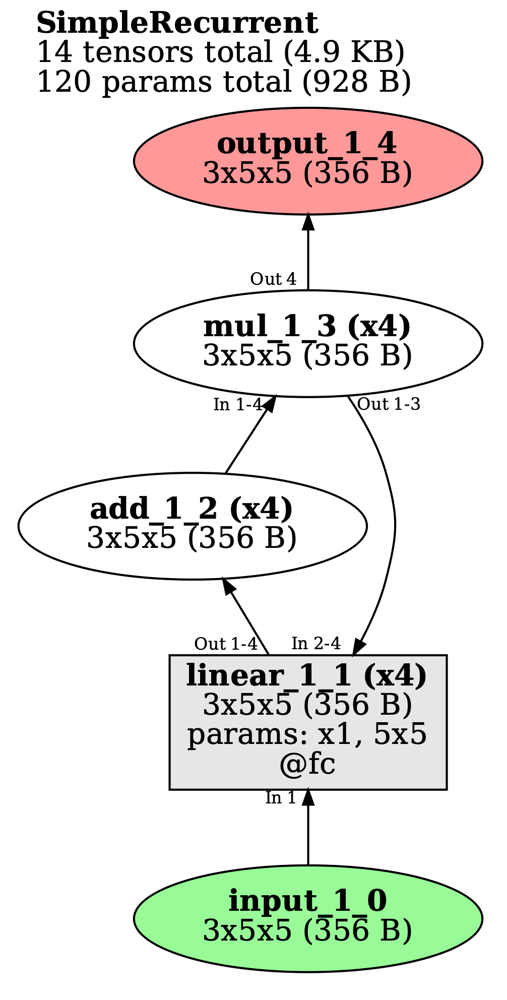
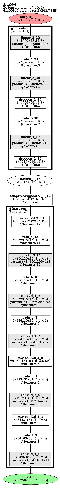

#Torch

## Overview

*TorchLens* is a app for doing exactly two things:

1) Easily extracting the activations from every single intermediate operation in a PyTorch model—no
   modifications needed—in one line of code. "Every operation" means every operation; "one line" means one line.
2) Understanding the model's computational structure via an intuitive automatic visualization and extensive
   metadata  about the network's computational graph.

Here it is in action for a very simple recurrent model; as you can see, you just define the model like normal and pass
it in, and *TorchLens* returns a full log of the forward pass along with a visualization:




And here it is for a very complex transformer model with 1932 operations
in its forward pass; you can grab the saved outputs of every last one:

## How-To Guide

Below is a quick demo of how to use it; for an interactive demonstration.

The main function of *TorchLens* is `log_forward_pass`: when called on a model and input, it runs a
forward pass on the model and returns a ModelHistory object containing the intermediate layer activations and
accompanying metadata, along with a visual representation of every operation that occurred during the forward pass:

```python
import torch
import torchvision
import torcheer as tl

alexnet = torchvision.models.alexnet()
x = torch.rand(1, 3, 224, 224)
model_history = tl.log_forward_pass(alexnet, x, layers_to_save='all', vis_opt='unrolled')
print(model_history)

'''
Log of AlexNet forward pass:
	Model structure: purely feedforward, without branching; 23 total modules.
	24 tensors (4.8 MB) computed in forward pass; 24 tensors (4.8 MB) saved.
	16 parameter operations (61100840 params total; 248.7 MB).
	Random seed: 3210097511
	Time elapsed: 0.288s
	Module Hierarchy:
		features:
		    features.0, features.1, features.2, features.3, features.4, features.5, features.6, features.7, 
		    features.8, features.9, features.10, features.11, features.12
		avgpool
		classifier:
		    classifier.0, classifier.1, classifier.2, classifier.3, classifier.4, classifier.5, classifier.6
	Layers:
		0: input_1_0 
		1: conv2d_1_1 
		2: relu_1_2 
		3: maxpool2d_1_3 
		4: conv2d_2_4 
		5: relu_2_5 
		6: maxpool2d_2_6 
		7: conv2d_3_7 
		8: relu_3_8 
		9: conv2d_4_9 
'''
```



You can pull out information about a given layer, including its activations and helpful metadata, by indexing
the ModelHistory object in any of these equivalent ways:

1) the name of a layer (with the convention that 'conv2d_3_7' is the 3rd convolutional layer, and the 7th layer overall)
2) the name of a module (e.g., 'features' or 'classifier.3') for which that layer is an output, or
3) the ordinal position of the layer (e.g., 2 for the 2nd layer, -5 for the fifth-to-last; inputs and outputs count as
   layers here).

To quickly figure out these names, you can look at the graph visualization, or at the output of printing the
ModelHistory object (both shown above). Here are some examples of how to pull out information about a
particular layer, and also how to pull out the actual activations from that layer:

```python
print(model_history['conv2d_3_7'])  # pulling out layer by its name 
# The following commented lines pull out the same layer:
# model_history['conv2d_3'] you can omit the second number (since strictly speaking it's redundant)
# model_history['conv2d_3_7:1'] colon indicates the pass of a layer (here just one)
# model_history['features.6'] can grab a layer by the module for which it is an output
# model_history[7] the 7th layer overall
# model_history[-17] the 17th-to-last layer
'''
Layer conv2d_3_7, operation 8/24:
	Output tensor: shape=(1, 384, 13, 13), dype=torch.float32, size=253.5 KB
		tensor([[ 0.0503, -0.1089, -0.1210, -0.1034, -0.1254],
        [ 0.0789, -0.0752, -0.0581, -0.0372, -0.0181],
        [ 0.0949, -0.0780, -0.0401, -0.0209, -0.0095],
        [ 0.0929, -0.0353, -0.0220, -0.0324, -0.0295],
        [ 0.1100, -0.0337, -0.0330, -0.0479, -0.0235]])...
	Params: Computed from params with shape (384,), (384, 192, 3, 3); 663936 params total (2.5 MB)
	Parent Layers: maxpool2d_2_6
	Child Layers: relu_3_8
	Function: conv2d (gradfunc=ConvolutionBackward0) 
	Computed inside module: features.6
	Time elapsed:  5.670E-04s
	Output of modules: features.6
	Output of bottom-level module: features.6
	Lookup keys: -17, 7, conv2d_3_7, conv2d_3_7:1, features.6, features.6:1
'''

# You can pull out the actual output activations from a layer with the tensor_contents field: 
print(model_history['conv2d_3_7'].tensor_contents)
'''
tensor([[[[-0.0867, -0.0787, -0.0817,  ..., -0.0820, -0.0655, -0.0195],
          [-0.1213, -0.1130, -0.1386,  ..., -0.1331, -0.1118, -0.0520],
          [-0.0959, -0.0973, -0.1078,  ..., -0.1103, -0.1091, -0.0760],
          ...,
          [-0.0906, -0.1146, -0.1308,  ..., -0.1076, -0.1129, -0.0689],
          [-0.1017, -0.1256, -0.1100,  ..., -0.1160, -0.1035, -0.0801],
          [-0.1006, -0.0941, -0.1204,  ..., -0.1146, -0.1065, -0.0631]]...
'''
